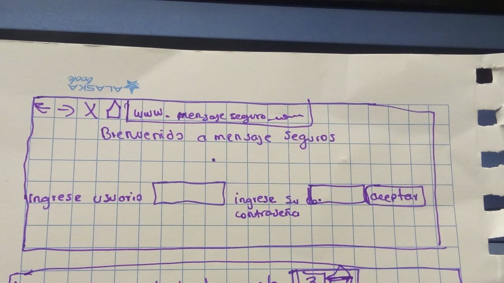
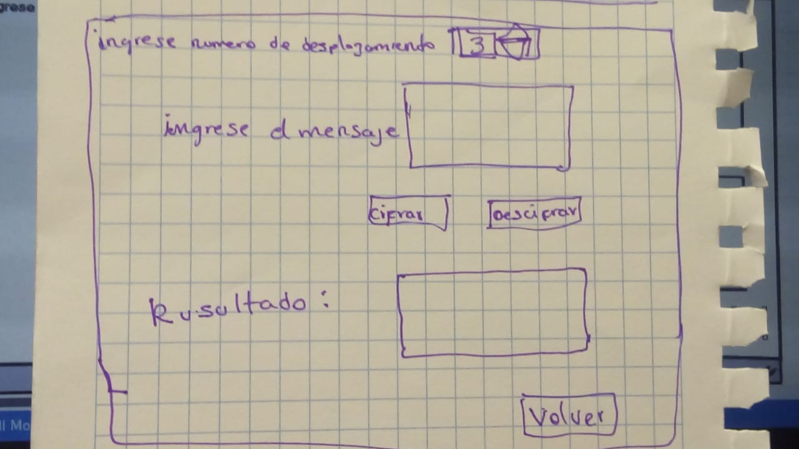
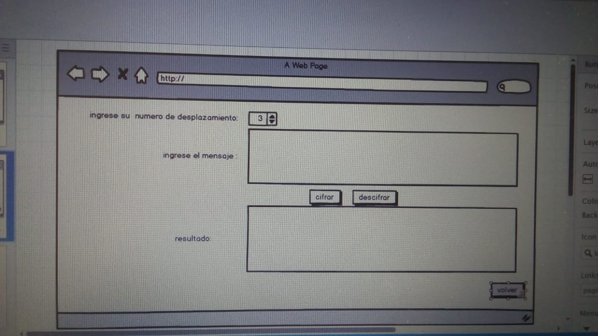
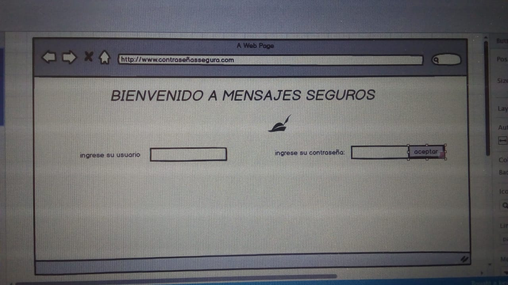

**`README.md`**:

# Un título con el nombre de tu proyecto.
BIENVENIDO A MENSAJES SEGUROS

# Un resumen de 1 o 2 líneas de qué se trata tu proyecto.
mi proyecto va dirigido a los estudiantes de la universidad para que puedan cifrar o descifrar mensajes que nadie más que ellos sepan para la seguridad de sus mensajes que ellos requieran .

# la imagen final de tu proyecto
.jpeg) "titulo")
.jpeg) "titulo")
# investigacion  ux
Bueno para llegar a esta imagen pregunté a dos personas como veian mi prototipo anterior las personas no estaban conforme con el resultado ya que en la anterior iba a tener 3 botones al final de cuadros una era descifrar la otra cifrar y la otra era volver y bueno una de las personas vio que le era más bonito no involucrar al botón volver con los otros botones por que no se veía tan bien y es por eso que los puse al final de esquina del lado derecho
Y bueno la otra persona me dijo que estaba bien pero que le pusiera una imagen y eso es lo que se va hacer para la pantalla 1 una imagen que caracterice a la página web

# explicar quienes son los usuarios y los objetivos en la relacion con el producto.
Los usuarios son estudiantes de la universidad que por querer mantener privado algunos asuntos de de estudio o proyectos es que realizamos este pagina web para que se no sufran plagios en sus proyectos de tesis o proyectos de mayor importancia de acuerdo a lo que ellos consideren

# Explicar cómo el producto soluciona los problemas/necesidades de dichos usuarios.
Soluciona a ocultar la información que el estudiante considere de lo más importante para y que corre riesgo de ser plagiado.

# Luego colocarás la foto de tu primer prototipo en papel.
 "titulo")
 "titulo")
# agregar un resumen del feedback recibido indicando las mejoras a realizar.
bueno en lo que me coemetaron de mi pagina es que les parece interesante que puedan descifrar mensajes y otro que podria usar que se pueda ingresar usuario para registrarse.
# Imagen del prototipo final en Balsamiq.
 "titulo")
 "titulo")